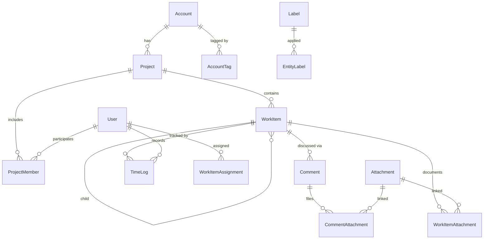

# Data Model & Entity Relationships

The solution manages a connected hierarchy of accounts, projects, work items, comments, time logs, users, attachments, and labels. This document outlines core entities, attributes, and relationships to support planning for EF Core migrations, API contracts, and offline synchronization.

## Entity Relationship Diagram

## Core Tables

### Account

| Column | Type | Notes |
| --- | --- | --- |
| `AccountId` | `uniqueidentifier` | Primary key. |
| `Name` | `nvarchar(200)` | Unique within tenant; search indexed. |
| `Code` | `nvarchar(50)` | Optional external identifier. |
| `AccountType` | `tinyint` | Enum (Customer/Supplier). |
| `Status` | `tinyint` | Enum (Active/Archived). |
| `Tags` | `nvarchar(max)` | Cached label names for search. |
| `CreatedAtUtc` | `datetime2` | Audit. |
| `UpdatedAtUtc` | `datetime2` | Audit. |
| `RowVersion` | `rowversion` | Concurrency token for sync. |

Related tables:

* `AccountContact` – Contact cards (name, email, phone, notes).
* `AccountTag` – Tag assignments referencing `Label`.

### Project

| Column | Type | Notes |
| --- | --- | --- |
| `ProjectId` | `uniqueidentifier` | Primary key. |
| `AccountId` | `uniqueidentifier` | FK → `Account`. |
| `Name` | `nvarchar(200)` | Required. |
| `Code` | `nvarchar(50)` | Short code; unique per account. |
| `OwnerUserId` | `uniqueidentifier` | FK → `User`. |
| `StageTemplateId` | `uniqueidentifier` | Optional reference to template definition. |
| `StartDate` | `date` | Planning. |
| `DueDate` | `date` | Planning. |
| `BudgetHours` | `decimal(10,2)` | For reporting. |
| `Status` | `tinyint` | Enum (Draft, Active, OnHold, Completed, Archived). |
| `ProgressPercent` | `decimal(5,2)` | Derived; stored for quick retrieval. |
| `CreatedAtUtc` | `datetime2` | Audit. |
| `UpdatedAtUtc` | `datetime2` | Audit. |
| `RowVersion` | `rowversion` | Concurrency token. |

Associated tables:

* `ProjectStageTemplate`, `ProjectStage` – Define stages and default assignments.
* `ProjectMember` – Join table linking users and roles (Manager, Contributor, Viewer).
* `ProjectNote` – Rich text notes per project.

### WorkItem

| Column | Type | Notes |
| --- | --- | --- |
| `WorkItemId` | `uniqueidentifier` | Primary key. |
| `ProjectId` | `uniqueidentifier` | FK → `Project`. |
| `ParentWorkItemId` | `uniqueidentifier` | Self-referencing for hierarchy. |
| `Title` | `nvarchar(200)` | Indexed for search. |
| `Description` | `nvarchar(max)` | Supports Markdown/HTML storage. |
| `Type` | `tinyint` | Enum (Task, Ticket, Bug, Epic). |
| `Status` | `tinyint` | Enum (Backlog, InProgress, Blocked, Done). |
| `Priority` | `tinyint` | Enum (Low, Medium, High, Critical). |
| `AssigneeUserId` | `uniqueidentifier` | Optional default assignee. |
| `EstimateHours` | `decimal(9,2)` | Planning metrics. |
| `DueDate` | `date` | For filters and notifications. |
| `Watchers` | `nvarchar(max)` | Cached user IDs for quick lookups. |
| `CreatedAtUtc` | `datetime2` | Audit. |
| `UpdatedAtUtc` | `datetime2` | Audit. |
| `RowVersion` | `rowversion` | Sync concurrency. |

Support tables:

* `WorkItemAssignment` – Many-to-many assignments for multiple contributors.
* `WorkItemAttachment` – Links to `Attachment` metadata.
* `WorkItemTag` – Links to `Label` classifications.
* `WorkItemChecklist` – Subtask checklist items with completion flags.

### Comment

| Column | Type | Notes |
| --- | --- | --- |
| `CommentId` | `uniqueidentifier` | Primary key. |
| `WorkItemId` | `uniqueidentifier` | FK → `WorkItem`. |
| `ParentCommentId` | `uniqueidentifier` | For threaded replies. |
| `AuthorUserId` | `uniqueidentifier` | FK → `User`. |
| `Body` | `nvarchar(max)` | Supports Markdown with sanitized HTML. |
| `CreatedAtUtc` | `datetime2` | Ordering. |
| `EditedAtUtc` | `datetime2` | Null unless edited. |
| `RowVersion` | `rowversion` | Sync concurrency. |

### TimeLog

| Column | Type | Notes |
| --- | --- | --- |
| `TimeLogId` | `uniqueidentifier` | Primary key. |
| `WorkItemId` | `uniqueidentifier` | FK → `WorkItem`. |
| `UserId` | `uniqueidentifier` | FK → `User`. |
| `StartedAtUtc` | `datetime2` | Start timestamp. |
| `StoppedAtUtc` | `datetime2` | Stop timestamp. |
| `DurationMinutes` | `int` | Derived for quick reporting. |
| `Source` | `tinyint` | Enum (Manual, Timer, Imported). |
| `Notes` | `nvarchar(500)` | Optional context. |
| `RowVersion` | `rowversion` | Sync concurrency. |

### User

| Column | Type | Notes |
| --- | --- | --- |
| `UserId` | `uniqueidentifier` | Primary key (Identity GUID). |
| `DisplayName` | `nvarchar(150)` | Required. |
| `Email` | `nvarchar(256)` | Unique, normalized. |
| `AvatarUrl` | `nvarchar(512)` | Optional. |
| `Role` | `tinyint` | Enum (Admin, ProjectManager, Contributor, Viewer). |
| `IsActive` | `bit` | Soft delete flag. |
| `LastSeenAtUtc` | `datetime2` | Presence tracking. |
| `CreatedAtUtc` | `datetime2` | Audit. |
| `UpdatedAtUtc` | `datetime2` | Audit. |

### Attachment

| Column | Type | Notes |
| --- | --- | --- |
| `AttachmentId` | `uniqueidentifier` | Primary key. |
| `FileName` | `nvarchar(260)` | Stored name. |
| `ContentType` | `nvarchar(100)` | MIME type. |
| `SizeBytes` | `bigint` | File size. |
| `StorageProvider` | `tinyint` | Enum (Azure, S3, Local). |
| `BlobPath` | `nvarchar(500)` | Storage key. |
| `Checksum` | `char(44)` | Base64 SHA256 for dedupe. |
| `UploadedByUserId` | `uniqueidentifier` | FK → `User`. |
| `UploadedAtUtc` | `datetime2` | Audit. |

### Label

| Column | Type | Notes |
| --- | --- | --- |
| `LabelId` | `uniqueidentifier` | Primary key. |
| `Name` | `nvarchar(100)` | Unique per tenant. |
| `Color` | `char(7)` | Hex color code for accent tags. |
| `Category` | `nvarchar(50)` | Optional grouping (Priority, Department). |
| `CreatedAtUtc` | `datetime2` | Audit. |

`EntityLabel` provides polymorphic tag assignments (`EntityType`, `EntityId`, `LabelId`).

## Indexing & Search

* Full-text indexes on `Project.Name`, `WorkItem.Title`, and `Comment.Body` support global search.
* Filter indexes on `WorkItem.Status`, `WorkItem.AssigneeUserId`, and `TimeLog.UserId` accelerate dashboard queries.
* `RowVersion` columns enable optimistic concurrency and incremental sync detection.

## Multi-Tenancy & Scoping

While the initial release focuses on a single-tenant deployment, the schema accommodates future tenant keys (`TenantId`) on root tables (`Account`, `User`, `Project`) with filtered indexes and query filters for row-level security.

## Data Retention & Archival

* Archived accounts/projects remain readable but locked for mutations; background jobs can relocate data to cold storage.
* Time logs older than a configurable window can be aggregated for long-term retention while keeping raw records accessible for audits.
* Attachments leverage lifecycle policies on the underlying storage provider to optimize costs.

